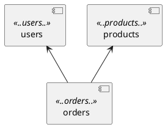

> A bad system will beat a good person every time.
> 
> -- <cite>Edwards Deming</cite>

To efficiently develop software, it is crucial to control its quality, particularly the architecture and code structure.
In Java, [ArchUnit](https://www.archunit.org/), a library for testing certain aspects of architecture and design, can help.
In this article, I'll present ten practical ArchUnit tests based on my experiences with developing a Spring Framework-based application.

While ArchUnit is a powerful tool, it can be challenging to fully utilize its capabilities and determine what is worth testing initially.
The tests I describe didn't come about all at once.
I started with two or three simple tests and then, over the years, added more or redefined existing ones as design rules were broken.
These rules can be violated for various reasons: in the rush of changes, it’s easy to forget certain principles, and new team members might not be aware of existing design constraints.
Writing these rules as tests is a way to formally express architecture and design, helping maintain project quality.

As a result, I have developed a practical set of tests that I can apply to my projects, ensuring their consistency and compliance with architectural assumptions.
Below, I present these tests using the ArchUnit library, which I employ in almost every Java project.
If you find them useful, simply copy them into your project.

## Context

Some of the described tests are universal, while others are more tied to the project structure.
To better understand and adapt them, here's an example package structure:

```
pl.tfij.example
+--- users
|    |--- domain
|    \--- infrastructure
+--- orders
|    |--- domain
|    \--- infrastructure
+--- products
|    |--- domain
|    \--- infrastructure
\--- commons
```

This structure is not a typical layered architecture.
Therefore, in this post, you won't find tests like "controllers use services, and services use repositories".

Secondly, I place all ArchUnit tests in a single test class, where I declare two constants useful for the tests.
When describing the tests in this article, I assume they are embedded in such a class:

```java
class ArchitectureTest {
    private static final String PROJECT_PACKAGE = "pl.tfij.example";

    private static final JavaClasses ALL_SERVICE_CLASSES = new ClassFileImporter()
            .withImportOption(new ImportOption.DoNotIncludeTests())
            .importPackages(PROJECT_PACKAGE);
    
    // ...
}
```

When writing about architecture tests, it’s worth mentioning a good practice.
If an architectural rule is documented, for example, in an [ADR](https://github.com/joelparkerhenderson/architecture-decision-record) (Architecture Decision Record),
it’s beneficial for the test verifying this rule to link to that document.
The test should clearly indicate why a particular invariant is important.
We should avoid situations where a failing test leaves a developer wondering, “But why? What’s wrong with doing it this way?”.
Such situations can lead to the test being removed, and the original architectural assumptions being lost.

## 1. Cycles in the Project

One of the most popular ArchUnit tests is cycle verification.
It's a simple yet important test to start with.

```java
@Test
@DisplayName("Packages should be free of cycles")
void packagesShouldBeFreeOfCycles() {
    slices()
            .matching("%s.(**)".formatted(PROJECT_PACKAGE))
            .should().beFreeOfCycles()
            .check(ALL_SERVICE_CLASSES);
}
```

## 2. Module Dependencies

In the previously presented package structure, the first-level modules are `users`, `orders`, `products`, and `commons`.
It's crucial for these modules' dependencies to be clear and in line with assumptions, for instance, `users` should not depend on `products`.
ArchUnit doesn't have a module abstraction but provides a way to test layered architecture, like ensuring controllers depend on services and services on repositories.
Treating modules as layers, we can define a test to verify module dependencies.

```java
@Test
@DisplayName("Each module should depend only on declared modules")
void modulesDependencyTest() {
    layeredArchitecture()
            .consideringOnlyDependenciesInLayers()
            .ensureAllClassesAreContainedInArchitectureIgnoring(PROJECT_PACKAGE)
            .layer("users")   .definedBy("pl.tfij.example.users..")
            .layer("orders")  .definedBy("pl.tfij.example.orders..")
            .layer("products").definedBy("pl.tfij.example.products..")
            .layer("commons") .definedBy("pl.tfij.example.commons..")
            .whereLayer("users")   .mayOnlyAccessLayers("commons")
            .whereLayer("orders")  .mayOnlyAccessLayers("users", "products", "commons")
            .whereLayer("products").mayOnlyAccessLayers("commons")
            .whereLayer("commons") .mayNotAccessAnyLayer()
            .check(ALL_SERVICE_CLASSES);
}
```

Representing modules as layers introduces some noise into the test, but it is the most concise solution in ArchUnit for achieving the goal of verifying module dependencies.

## 3. Code Compliance with Documentation

Another way to verify dependencies between modules is by using a [PlantUML](https://plantuml.com/) diagram,
which also helps control if documentation is up-to-date (if the documentation, including the PlantUML diagram, is stored alongside the code).
In the described case, we can define a component diagram in PlantUML:



I intentionally omitted the commons module from the diagram to maintain readability, especially important for more complex systems with many modules.
Below is the rendered version of the diagram.


ArchUnit has built-in support for PlantUML.
Although only a subset of the syntax is supported, our code can be verified against a simple diagram like the one above.
The test to achieve this looks like:

```java
@Test
@DisplayName("The code should follow the architecture diagram")
void codeShouldFollowArchitectureDiagram() {
    classes()
            .should(adhereToPlantUmlDiagram(
                    "doc/KeyModulesDependencies.puml",
                    consideringOnlyDependenciesInDiagram()))
            .check(ALL_SERVICE_CLASSES);
}
```

It should be noted that this test has certain limitations.
If the diagram shows a dependency A on B, the test will pass even if such a dependency is not present in the code.
In other words, the diagram defines possible transitions, which may or may not appear in the code.

## 4. Domain Should Not Depend on Infrastructure

A fundamental rule of hexagonal architecture, ports and adapters, onion architecture,
or clean architecture is the dependency inversion principle – high-level modules should not directly depend on low-level modules.
Specifically, the domain should not depend on the infrastructure; rather, the infrastructure may depend on the domain.
This rule can be verified with a simple test:

```java
@Test
@DisplayName("Domain should not depend on infrastructure")
void domainShouldNotDependOnInfrastructure() {
    classes()
            .that().resideInAPackage("..domain..")
            .should().onlyDependOnClassesThat().resideOutsideOfPackage("..infrastructure..")
            .check(ALL_SERVICE_CLASSES);
}
```

If the project strictly follows hexagonal architecture guidelines, we can define tests like:

```java
@Test
@DisplayName("The order module should follow the onion architecture")
void verifyOrdersOnion() {
    onionArchitecture()
            .domainModels("pl.tfij.example.orders.domain.model..")
            .domainServices("pl.tfij.example.orders.domain.service..")
            .adapter("persistence", "pl.tfij.example.orders.infrastructure.persistence..")
            .adapter("rest", "pl.tfij.example.orders.infrastructure.rest..");
}
```

In this case, we must define a separate test for each module.
This test more strictly controls adherence to principles of consistency and responsibility of individual packages.

## 5. Domain Should Not Depend on Database Internals

So far, we have ensured that the `domain` package does not depend on `infrastructure`.
However, there is no guarantee that a class from the infrastructure is placed in the correct location.
In one project, it turned out that a class containing SQL code ended up in the domain.
To prevent such mistakes, we added a test:

```java
@Test
@DisplayName("Domain should not depend on database internals")
void domainShouldNotDependOnDatabaseInternals() {
    classes()
            .that().resideInAPackage("..domain..")
            .should().onlyDependOnClassesThat().resideOutsideOfPackages(
                    "org.springframework.jdbc.**",
                    "java.sql.**",
                    "jakarta.persistence.**")
            .check(ALL_SERVICE_CLASSES);
}
```

Similarly, we can exclude packages related to Kafka, JSON serialization, or other technologies that should not appear in the domain.
These types of tests help ensure that domain code remains clean and independent of technical details, which is key to maintaining clarity and flexibility in architecture.

Alternatively, instead of defining packages that are prohibited in the domain, you can define a set of packages that are allowed.
Personally, however, I prefer defining a blacklist, as the test is more stable in the face of changes, especially in the early stages when the project is rapidly evolving.

## 6. Constructor Injection

A good practice in Spring is to inject dependencies (dependency injection – not to be confused with the aforementioned dependency inversion) through the constructor, not through fields or setters.
There are many articles online on this topic, such as [Reflectoring: Constructor Injection](https://reflectoring.io/constructor-injection/).
To ensure that there is no field-based injection, we just need to check that no field is annotated with `@Autowired` or `@Value`.

```java
@Test
@DisplayName("Should not inject by field (required injection by constructor)")
void shouldNotInjectByField() {
    fields()
            .should().notBeAnnotatedWith(Autowired.class)
            .andShould().notBeAnnotatedWith(Value.class)
            .check(ALL_SERVICE_CLASSES);
}
```

This test ensures that all dependencies are constructor-based, which is considered best practice in Spring.

## 7. Metrics

In Spring, it's easy to collect metrics using [Micrometer](https://micrometer.io/docs/), and good metrics are a crucial element in maintaining an application in a production system.
Specifically, we should have data on every endpoint.
Therefore, every public controller method should be annotated with `@Timed`.
It’s easy to forget to add such an annotation.
Fortunately, we can safeguard against this with an ArchUnit test:

```java
@Test
@DisplayName("Controller public methods should be annotated with @Timed")
void controllerPublicMethodsShouldBeAnnotatedWithTimed() {
    methods()
            .that().areDeclaredInClassesThat().haveNameMatching(".*Controller")
            .and().areDeclaredInClassesThat().areNotInterfaces()
            .and().areNotPrivate()
            .should().beAnnotatedWith(Timed.class)
            .check(ALL_SERVICE_CLASSES);
}
```

In my projects, service classes are the entry points to the domain.
Therefore, I also collect metrics for each public method in the service classes.

```java
@Test
@DisplayName("Service public methods should be annotated with @Timed")
void servicePublicMethodsShouldBeAnnotatedWithTimed() {
    methods()
            .that().areDeclaredInClassesThat().haveNameMatching(".*Service")
            .and().areDeclaredInClassesThat().areNotInterfaces()
            .and().areNotPrivate()
            .should().beAnnotatedWith(Timed.class)
            .check(ALL_SERVICE_CLASSES);
}
```

## 8. Naming Conventions

In different projects, controllers might have various names such as `*Controller`, `*Endpoint`, `*Resource`, `*Api`, `*Handler`.
However, a naming standard is often not consistently maintained within a single project.
It's worth defining ArchUnit tests to ensure that all controller classes end with, for example, Controller.

```java
@Test
@DisplayName("Controller classes should end with 'Controller'")
void controllersShouldEndWithController() {
    classes()
            .that().areAnnotatedWith(RestController.class)
            .should().haveNameMatching(".*Controller")
            .check(ALL_SERVICE_CLASSES);
}
```

Similarly, you can test the names of Repository, Entity classes, or the package names in which they are placed.
This ensures consistency and makes maintaining the code easier.

## 9. Each Module Should Have a Single Configuration Class

In my projects, I adhere to the rule that each module should have a single entry point - one class that can produce a configured module.
This can be described as a factory for a configured module.
For me, this is a Config class that creates a bean serving as the module’s facade.
In other words, each module should have one and only one configuration class.
This configuration class is also used in unit tests to produce the module to test.
This makes verifying the domain part of the entire module easier.

A test ensuring the existence of a single configuration class is somewhat more complex than the tests presented earlier:

```java
@Test
void eachInfrastructurePackageShouldContainSingleConfigClass() {
    // Import classes from the package
    JavaClasses importedClasses = new ClassFileImporter().importPackages(PROJECT_PACKAGE);
    // Identify infrastructure packages
    Set<String> infrastructurePackages = importedClasses.stream()
            .map(JavaClass::getPackageName)
            .filter(packageName -> packageName.endsWith(".infrastructure") || packageName.contains(".infrastructure."))
            .map(packageName -> packageName.substring(0, packageName.indexOf(".infrastructure") + ".infrastructure".length()))
            .collect(Collectors.toSet());
    // Find *Config classes in each infrastructure package
    Map<String, List<String>> configClassesByPackage = infrastructurePackages.stream()
            .collect(Collectors.toMap(
                    packageName -> packageName,
                    packageName -> findConfigClassesInGivenPackage(importedClasses, packageName)));
    // Verify if each infrastructure package has exactly one *Config class
    configClassesByPackage.forEach((packageName, configClasses) -> {
        Assertions.assertEquals(1, configClasses.size(),
                "Package `%s` should contain exactly one *Config class but contains %s".formatted(
                        packageName,
                        String.join(", ", configClasses)));
    });
}

private static List<String> findConfigClassesInGivenPackage(JavaClasses importedClasses, String packageName) {
    return importedClasses.stream()
            .filter(javaClass -> javaClass.getPackageName().startsWith(packageName))
            .map(JavaClass::getSimpleName)
            .filter(className -> className.endsWith("Config"))
            .toList();
}
```

This test ensures that each module in the project has exactly one configuration class named Config.
Such an organization of the code makes managing module configurations and testing them easier.
It makes it easy to find and understand where the configuration for each module is located.

## 10. Beans Created in Configuration Class

In my code, I do not use annotations like `@Service` or `@Component`.
Such beans should be created in a configuration class using `@Bean`.
This is consistent with the previously described rule that the config class is a factory providing a configured module.
This can be verified with a test:

```java
@Test
@DisplayName("Classes should not be annotated with @Service or @Component (create beans in a config class)")
void classesShouldNotBeAnnotatedWithService() {
    classes()
            .should().notBeAnnotatedWith(Service.class)
            .andShould().notBeAnnotatedWith(Component.class)
            .check(ALL_SERVICE_CLASSES);
}
```

This test verifies that all beans are created in configuration classes rather than using the `@Service` or `@Component` annotations on the classes.
This allows centralized management of bean configurations in the project, making it easier to monitor, modify, and test them.

## ArchUnit Limitations

ArchUnit works based on compiled code.
This entails certain limitations that should be acknowledged.
For instance, constant literals can be inlined, and a dependency that exists in the source code might disappear in the bytecode.
For example, if a public constant of type String is defined in the infrastructure.
In the domain, this constant is referenced.
A test verifying that the domain should not depend on the infrastructure will not catch such a dependency.

It’s important to remember that ArchUnit operates on bytecode to avoid unpleasant surprises like the one described above.

## Message for Today

Add a test if you discover a violation of any design or architectural rule.
If a rule has been broken once, it proves that it can be broken again.
